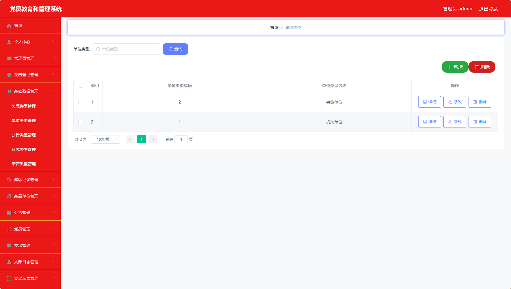

# springboot 党员教育和管理系统 / springboot-Party_Member_Education_and_Management


> 更多毕设项目可跳转至项目导航栏检索：[毕设项目](http://sysadmin.3vfree.vip)，需要联系博主v：xq-lucky311，q：1047944234. 备注：项目咨询

注：由于前端项目太大，仅上传了后端代码，未包含前端代码...

## 项目简介  
基于 SpringBoot + Vue + MyBatis Plus 的党员教育管理系统，提供党员信息管理、党费登记、奖惩记录、公告发布等核心功能，实现党务管理数字化和规范化。

## 特征介绍  
- **权限控制**：Shiro 安全框架集成，配合自定义注解（@LoginUser）实现接口级权限验证。  
- **高效开发**：MyBatis Plus 简化 CRUD 操作，自动填充字段（MyMetaObjectHandler）。  
- **模块化设计**：分层架构（controller/service/dao/entity）支持功能扩展。  
- **文件管理**：独立文件控制器（FileController）实现上传/下载功能。  
- **多视图支持**：VO/View/Model 多维度数据模型适配不同业务场景。  

## 代码结构 
```
src/
├── main/
│   ├── java/
│   │   ├── com/
│   │   │   ├── annotation/          # 权限注解（LoginUser.java）
│   │   │   ├── config/              # 全局配置（MybatisPlusConfig.java）
│   │   │   ├── controller/          # 接口层（DangfeidengjiController.java）
│   │   │   ├── dao/                 # 数据访问层（DangfeidengjiDao.java）
│   │   │   ├── entity/              # 数据模型
│   │   │   │   ├── model/           # 业务模型（DangfeidengjiModel.java）
│   │   │   │   ├── view/            # 视图模型（DangfeidengjiView.java）
│   │   │   │   ├── vo/              # 值对象（DangfeidengjiVO.java）
│   │   │   ├── interceptor/         # 请求拦截器（AuthorizationInterceptor.java）
│   │   │   ├── service/             # 服务层
│   │   │   │   ├── impl/            # 服务实现（DangfeidengjiServiceImpl.java）
│   │   │   ├── utils/               # 工具类（FileUtil.java）
│   ├── resources/
│   │   ├── mapper/                  # MyBatis映射文件（DangfeidengjiDao.xml）
│   │   ├── application.yml          # 主配置
│   │   ├── static/                  # 静态资源
│   │   │   ├── upload/              # 上传文件存储
```
## 使用说明
1. 数据库配置：修改 `application.yml` 中的数据库连接信息：
```yaml
	url: jdbc:mysql://127.0.0.1:3306/dangyuanjiaoyuguanli
	username: root
	password: 123456
```

2. 访问地址：
后台登录页：http://localhost:8080/dangyuanjiaoyuguanli/admin/dist/index.html

3. 测试账号：
管理员：admin/admin
党员：a1/123456
支部：a1/123456

4. 注意事项：
图片上传路径：src/main/webapp/upload
上传图片名禁止包含中文
推荐使用谷歌浏览器访问


# 项目实际截图：
## 登录：


## 后台：





> 等等...

# 精选项目导航 & 快速部署工具
## 项目资源一站直达
- ​**访问项目导航站**：[点击进入](http://sysadmin.3vfree.vip)**快速检索所需项目名称**
- ​**技术栈全覆盖**：Java/SSm/Spring Boot/小程序等主流技术方案
- ​**配套资源**：每个项目均提供部署文档 + 演示视频（附效果截图）

### ▌导航站预览


### ▌工具界面预览


## 捐赠
> 博主将持续更新Java全栈开发项目，包含ssm，springboot，前后端分离系统等项目。
> 此外如果您够宽裕，请博主喝杯咖啡吧！捐赠将用于服务器维护与开源社区建设，感谢您的认可！
> 如需更多Java相关项目毕设3000+，有其他项目需求，sql文件等可联系博主v:xq-lucky311

---
